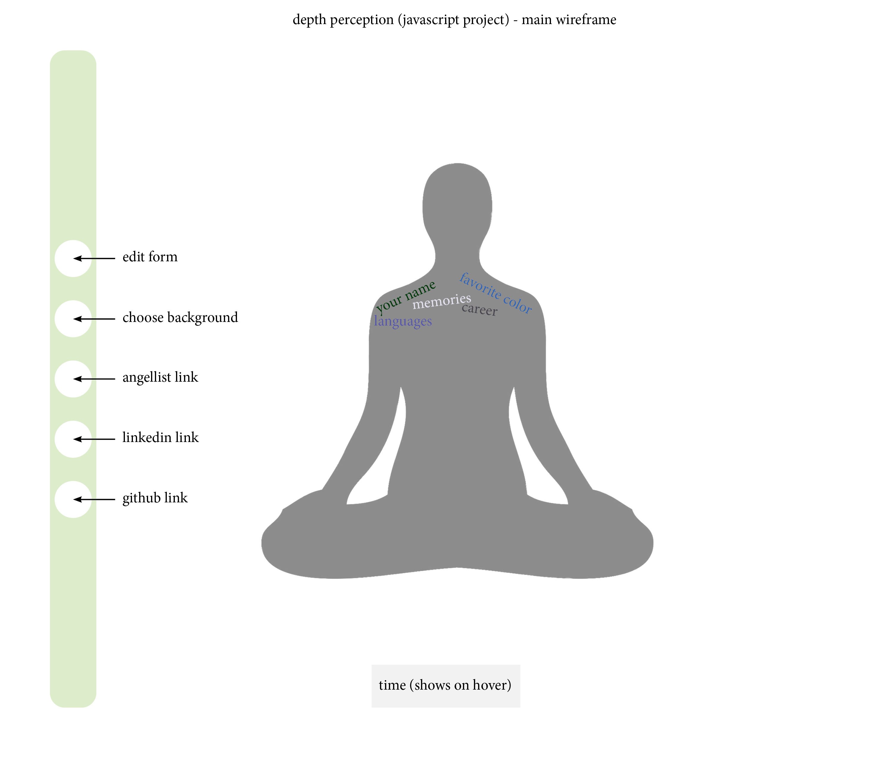

# Depth Perception #

### **Background and Overview** ###

Shed the superficial layers of what we perceive to be "self" with Depth Perception - a visualization app that guides you into deeper meditation and higher consciousness.

### **Functionality and MVPs** ###

* User can submit their name and other attributes
* User can choose a background scene ("space")
* User can choose from selection of background music / guided meditation
* User can set the time of length for meditation

### **Wireframes** ###

### **Architecture and Technology** ###

* Javascript
* Webpack for bundling files
* Adobe Animate for animations
* Adobe After Effects for animations

### **Implementation Timeline** ###

#### Day 1 ####
* Set up webpack and Node modules
* Entry files and skeletons for supporting scripts
* Review Adobe Animate and After Effects to implement into app

#### Day 2 ####
* Build out forms
* Build out meditating silhouette form (possibly a circle)
* Research and review how to add to user-submitted information to be animated
* Begin implementing animations of user-submitted information

#### Day 3 ####
* Continue animations for user-submitted information
* Create navigation bar
* Review how to embed countdown timer
  
#### Day 4 ####
* Finish up all meditation silhouette animations
* Finish implementation of countdown clock
* Build out "choose background" options
* Build out music/sound options and build out options for user

### **Bonus Features** ###
Potential features to incorporate:
* Incorporate options for meditation space, such as zen objects and individual sounds
* Different types of animation for specific meditations