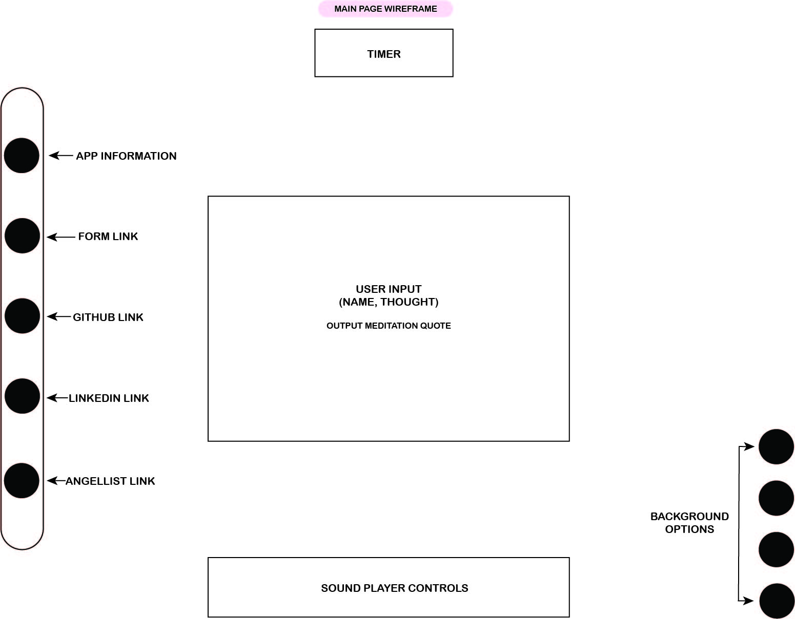

<link rel="stylesheet" type="text/css" media="all" href="./readme.css" />

# Depth Perception

[Live Demo](https://catherinekimyj.github.io/depth-perception/)

### **Background and Overview**

Depth Perception is a meditation visualization demo that allows the user to write down thoughts that manifest their mind and visualize letting go of those thoughts.

The words submitted by the user will slowly dissipate to the length of the chosen meditation sound. The speed of dissipation is dependent on the length of both the submitted input and the music; the animation duration is calculated so that the last bits of user input will dissolve towards the end of the track.


### **Functionality and MVPs**

- Name input can be multiple words and is automatically capitalized
- User can submit their name and 1000 character max text (current train of thought)
- A randomly selected meditation quote (from an array of quotes) will be displayed
- User can choose from selection of background music of varying lengths
- User can select a backdrop from a list of sceneries
- Depending on the length of selected music and the length of text, animation duration will be determined
- Animation will pause when audio is paused by the user, and will resume once the audio resumes
- Supports various heights and widths of screen

Below is an example of how Depth Perception adjusts to different window sizes:

<p align="center">
  
</p>


### **Wireframes**

The Depth Perception demo loads a modal containing the form. The greeting is customized to the user's local time ("Good morning", "Good afternoon", "Good evening"). User has an input box for the name, and another to write out their thoughts. Neither fields are required.

App Information button at the top of the navbar shows basic instructions and information.


Once submitted, the user is led to the main page where meditation of different lengths can be selected. As shown below:



### **Architecture and Technology**

- Javascript
- HTML
- SCSS for styling and animations
- Webpack for bundling files

### **Highlighted Feature**

The animation begins when an event listener on the "play" event of the audio player is triggered. The animation is calculated to last over the duration of the chosen music. The following code snippet shows how the calculation was achieved.

The sum of character lengths of the name input, the randomly selected quote, and the thought input is saved to a variable. Then, the number of milliseconds of the each song is divided by the variable (storing the combined character length, plus 4 characters for buffer) to output the ratio we will use for delay time of characters and duration of each character animation. Each character is wrapped in a `<span>`, so that the animation can be applied individually to each character.

```javascript
const anim = function () {
  let userGreet = document.getElementById("user-output-greet");
  let userText = document.getElementById("user-output-words");
  let userEncourage = document.getElementById("user-output-encourage");
  let selection = document.getElementById("selection");
  let userGreetTime = userGreet.innerText.match(/\S/g).length;
  let userEncourageTime = userEncourage.innerText.match(/\S/g).length;
  let userTextTime = userText.innerText.length;
  let delayTime;
  let combinedChars;

  if (userTextTime === undefined || userTextTime === 0) {
    combinedChars = userEncourageTime + userGreetTime;
  } else {
    let userTextTime = userText.innerText.match(/\S/g).length;
    combinedChars = userTextTime + userGreetTime + userEncourageTime;
  }

  if (selection.value === "./src/public/music/brainwaves.mp3") {
    delayTime = 600000/(combinedChars + 4);
  } else if (selection.value === "./src/public/music/ocean_waves.mp3") {
    delayTime = 489000/(combinedChars + 4);
  } else if (selection.value === "./src/public/music/relaxing.mp3") {
    delayTime = 304000/(combinedChars + 4);
  } else if (selection.value === "./src/public/music/30_sec.mp3") {
    delayTime = 30000/(combinedChars + 4);
  }

  textAnimation = anime.timeline({ loop: false }).add({
    targets: ".letters",
    opacity: [1, 0],
    easing: "easeInExpo",
    duration: delayTime * 3,
    autoplay: false,
    direction: "normal",
    delay: (el, i) => delayTime * i
  });
};
```

### **Implementation Timeline**

#### Day 1

- Set up webpack and Node modules
- Entry files and skeletons for supporting scripts
- Review possible animations to be used for dissipating text

#### Day 2

- Build out forms and modal
- Build out information modal
- Research and review how to add to user-submitted information to be animated
- Begin implementing animations of user-submitted text

#### Day 3

- Create an array of meditation quotes to be randomly selected if user does not input text
- Create navigation bar with buttons to form and contact information
- Review how to embed audio player
- Review how to time text animation to length of music

#### Day 4

- Finish up all animations, including text, modals, greeting, etc.
- Finish implementation of audio player
- Build out music/sound options for user

#### **Bonus Features**

Potential features to incorporate:

- User can change background on settings
